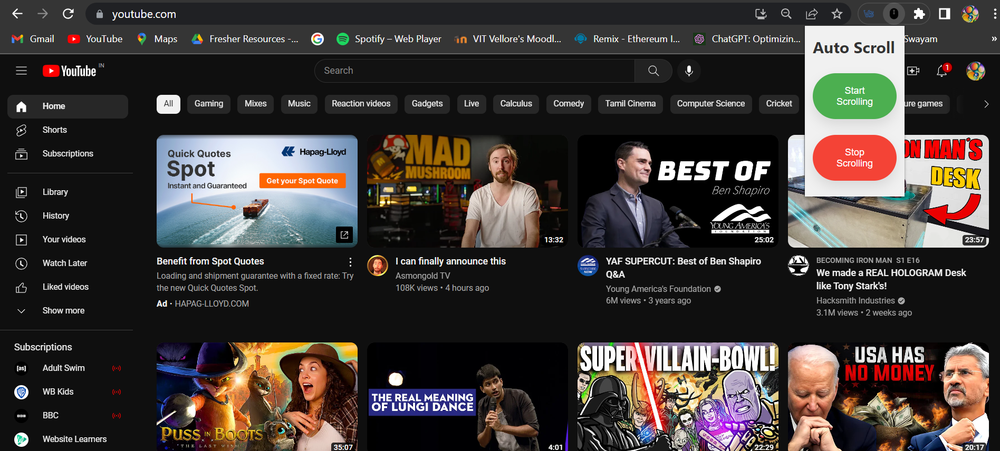

# Auto Scroll Extension

Auto Scroll is a Chrome extension that allows you to automatically scroll web pages with a click of a button. It's useful for hands-free reading, browsing, and monitoring content.

## Features

- Start and stop automatic scrolling with a click of a button.
- Smooth scrolling experience.

## Installation

1. Clone the repository or download the source code as a ZIP file.
2. Open Google Chrome and go to `chrome://extensions`.
3. Enable the Developer mode using the toggle switch in the top-right corner.
4. Click on "Load unpacked" and select the directory where you cloned/downloaded the extension.
5. The Auto Scroll extension should now be installed and ready to use.

## Usage

1. Navigate to a web page you want to scroll automatically.
2. Click on the Auto Scroll extension icon in the Chrome toolbar.
3. Click on the "Start Scrolling" button to begin automatic scrolling.
4. To stop scrolling, click on the "Stop Scrolling" button or close the web page.

## Feedback and Contributions

Feedback and contributions are welcome! If you encounter any issues or have suggestions for improvements, please open an issue on the GitHub repository.

## License

This project is licensed under the [MIT License](LICENSE).

